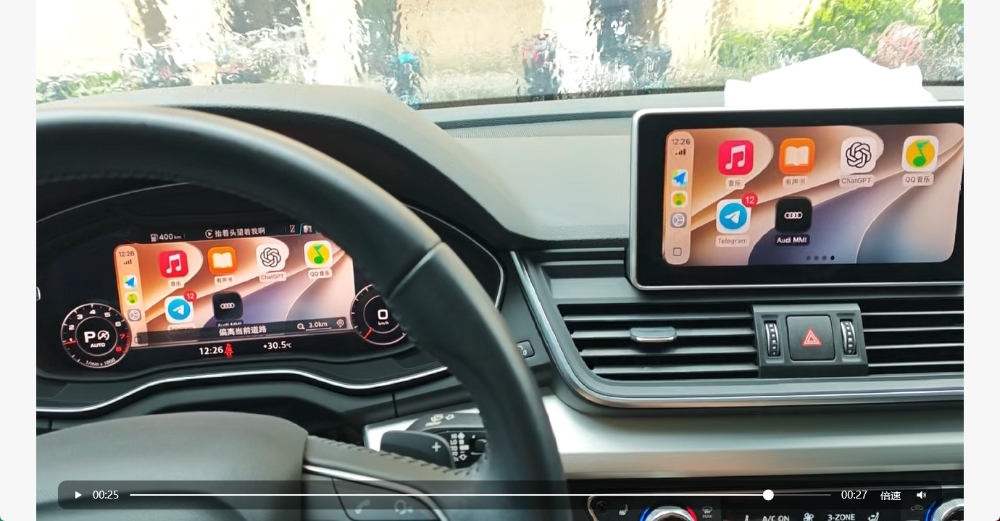

# MIB2Q MMI Cockpit Mirror

English | [简体中文](README.md)

Mirrors the complete live MMI output of an MIB2Q head unit to the Audi Virtual
Cockpit.

This repository keeps [jilleb/mib2-toolbox](https://github.com/jilleb/mib2-toolbox)
as its full base and adds the Green Engineering Menu, the B3-OPT v52 runtime,
fail-safe recovery, log recording, and reproducible source code. It is not
CarPlay AltScreen and it is not a turn-by-turn icon forwarder. It captures the
whole MMI output: when the center screen shows CarPlay the cockpit shows
CarPlay, and when it shows an MMI page the cockpit shows that MMI page.

## In-vehicle result



> [!CAUTION]
> This is an experimental, firmware-specific modification that writes to the
> MMI system partition. A mistake can cause a black screen, service faults, or
> require head-unit recovery. Use it only while parked, with stable power and
> verified backups. No contributor or referenced project accepts liability for
> damage to a vehicle, head unit, data, or warranty.

## Supported target

- Tested vehicle: 2020 Audi Q5L
- Firmware: `MHI2Q_CN_AUG22_P1404`
- Destination: Audi Virtual Cockpit `context 76 / displayable 58`
- Input: the MMI renderer's internal 1024×480 frame
- Output: approximately 30 FPS, 80% scale, horizontally centered and shifted up
- Lifetime: until STOP, a full MMI reboot, or watchdog recovery

The scripts reject other firmware versions. Do not remove that check to try an
unknown model or train.

## Relationship to CarPlay RGI

The B3 video path no longer consumes RGI navigation messages and does not start
`maneuver_render`:

- no navigation application is required;
- route, maneuver, and BAP RGI data are not used;
- the complete MMI output is captured, not a CarPlay-navigation-only surface;
- the SD-owned `libcp_mirror.so` explicitly starts the native capture clock.

The Java controller that switches the cockpit channel is still derived from the
JAR/plugin structure in
[luka-dev/mib2q-carplay-rgi](https://github.com/luka-dev/mib2q-carplay-rgi).
The public artifact is now named `Cockpit_Mirror.jar`. Mirror-only mode disables
RGI messages, BAP takeover, and the maneuver renderer, but renaming the artifact
does not relicense or completely rewrite its historical third-party code. See
[THIRD_PARTY_NOTICES.md](THIRD_PARTY_NOTICES.md).

## Green Menu

```text
MQB Coding Toolbox
└─ Customization
   └─ MMI Cockpit Mirror
      ├─ START - 30FPS persistent MMI cockpit mirror
      ├─ STOP - disable mirror and restore Audi map
      └─ LOG RECORD - save current B3 status and logs
```

## Installation

1. Download or clone this repository and place its complete root on a healthy
   FAT32 SD card.
2. Follow the [original MIB2 Toolbox installation guide](https://github.com/jilleb/mib2-toolbox#how-to-install)
   and complete the Toolbox software update.
3. Insert the SD card and open the `MMI Cockpit Mirror` menu shown above.
4. On the first `START`, the script checks `Cockpit_Mirror.jar`:
   - if missing, it backs up the current state and installs the controller;
   - if a legacy `carplay_hook.jar` exists, it is backed up to the SD card and
     migrated to the new filename;
   - this first action only installs the controller and requests a full reboot.
5. After the write completes, fully reboot the MMI. Open the menu and select
   `START` again to begin mirroring.
6. Keep the SD card inserted while the mirror is active. Select `STOP` to exit.

Controller backups and installation logs are stored under:

```text
Backup/MHI2Q_CN_AUG22_P1404/MMI_Cockpit_Mirror/
```

## Fail-safe behavior

- worker, renderer, clock host, and watchdog use separate recorded PIDs;
- the watchdog checks PIDs with `kill -0` instead of relying on command lines
  that P1404 truncates;
- a failed first-frame, EGL, Java-context, or frame-counter gate disarms the
  mirror before recovery;
- STOP and fault recovery restore Audi `context 74`;
- the mirror never starts automatically after an MMI reboot.

Do not remove the SD card or power while a system file is being written.

## Logs

`LOG RECORD` creates:

```text
Log/CarPlayMirror/Records/B3_<timestamp>_<pid>/
```

The snapshot includes status, measured FPS, renderer/EGL output, clock-host
output, watchdog state, Java context state, recorded PIDs, and DisplayManager
state.

Persistent logs are bounded: each START truncates the previous active logs,
and the watchdog checks high-volume logs once per minute. A file above 2 MiB
is rotated to a single `.previous` copy, so each managed log uses about 4 MiB
at most. LOG RECORD snapshots are created only when explicitly selected.

## Repository layout

```text
Toolbox/GEM/mqb-mmiCockpitMirror.esd       Green Menu screen
Toolbox/scripts/                           START / STOP / watchdog / log scripts
Toolbox/carplay_mirror_test/               QNX runtime files and fixed config
Toolbox/apps/mmi-cockpit-mirror/           Cockpit_Mirror.jar
src/native/                                native capture and renderer injection
src/java/                                  cockpit controller and compatibility code
build-scripts/                             build and renderer-patching scripts
docs/B3_REPRODUCIBLE_CHAIN.md              reproducible implementation record
docs/V52_CLOCK_HOST_FIX.md                 bilingual v52 long-run fix note
```

## Current status

- v50 has been short-run tested near 30 FPS on `MHI2Q_CN_AUG22_P1404`;
- v51 preserves that path, fixes long-running FPS telemetry overflow, and
  bounds runtime log usage; the revision awaits its next in-car verification;
- v52 fixes clock-host `LD_PRELOAD` inheritance: the main shell loads the
  mirror library once, while child `/bin/sleep` processes no longer create
  duplicate workers. The previous behavior made the clock host exit after
  roughly 19.5 minutes in the captured run;
- it retains the proven `sh -c` host that starts the native server;
- PID liveness checks remove the old false recovery at roughly 40 seconds;
- the new `Cockpit_Mirror.jar` filename and first-START migration still require
  continued in-car validation;
- multi-hour thermal stability and other firmware trains are not claimed.

## Credits and references

- [jilleb/mib2-toolbox](https://github.com/jilleb/mib2-toolbox) — complete
  Toolbox base, SD layout, software-update workflow, and Green Menu framework.
- [luka-dev/mib2q-carplay-rgi](https://github.com/luka-dev/mib2q-carplay-rgi) —
  MHI2Q CarPlay/RGI research, Java plugin structure, QNX hooks, and cockpit
  rendering reference.
- [Lanye-z/mib2-toolbox-carplay-rgi](https://github.com/Lanye-z/mib2-toolbox-carplay-rgi) —
  earlier Toolbox/RGI integration and deployment reference.

The primary additions in this repository are renderer-local full-MMI texture
capture, displayable-58 output, persistent 30-FPS control, VIEW recovery, PID
watchdog behavior, and the in-car logging/rollback workflow.

## License

The original MIB2 Toolbox retains its [MIT License](LICENSE). Newly authored
scripts and source in this project are offered under the same MIT terms.
Third-party-derived files, reverse-engineering material, and binaries do not
automatically become MIT-licensed; see
[THIRD_PARTY_NOTICES.md](THIRD_PARTY_NOTICES.md).
